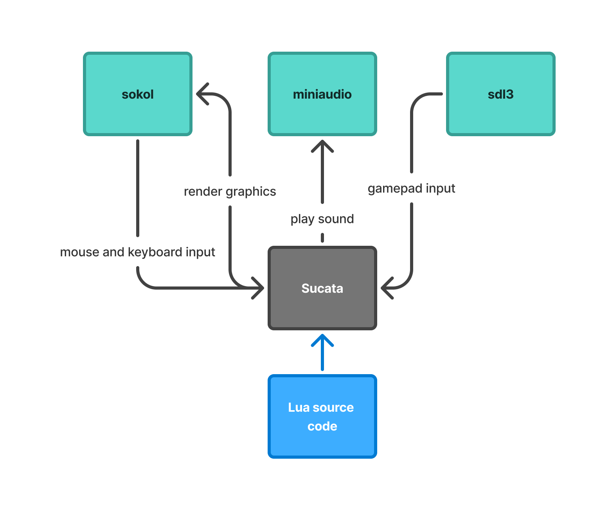
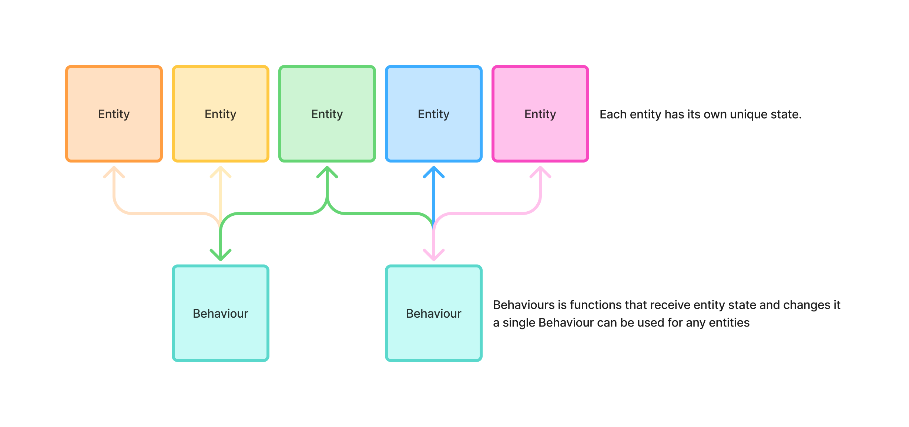
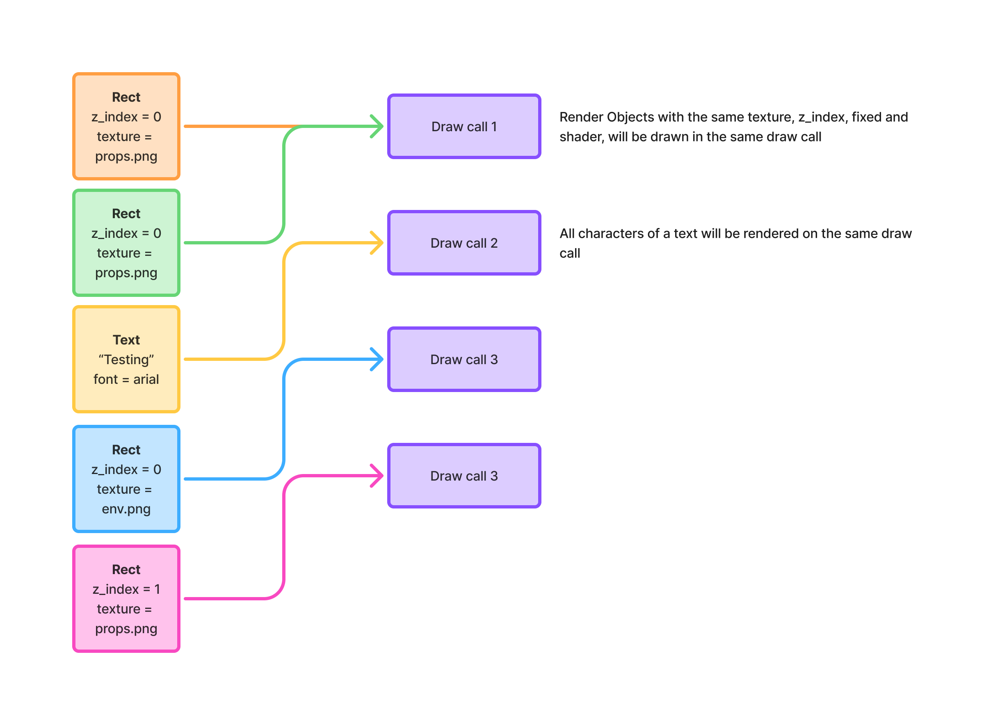

# Concepts

Sucata is a functional and modular game engine.

## How the engine works?



The engine interprets the lua source code, registering actions, calling sokol for graphic render, miniaudio for play audio, receiving gamepad input from sdl, keyboard and mouse inputs from sokol, and any events call back some lua functions 

## Scene

A scene is a pool of entities, and it's the main way to organize your game, you
can active a scene to load its entities.

## Entity



An entity is a table that contains state and behaviours, state is unique for the entity, behaviours it is scripts can be reused

### State

The entity state contains all unique data about this entity, including your unique id

#### id

The unique id of the entity, generated by the engine when the entity is spawned.

### Behaviours

You can define a list of behaviours that will be executed to changed state

> Behaviours will be executing by the order defined

## Behaviour

Behaviour is a table with a collections of stateless functions, that recieve an state and changes it, the design of the behaviour it is to be modular, small scripts that can be reused in many entities

#### init(state)

Called when the scene is loaded

This function will be called only once.

> This function is optional, and you can omit it if you don't need execute any
> code when the entity is loaded.

#### tick(state)

Called every frame to update the entity

You can call `sucata.time.get_delta()` to get the time since the last frame, and
use it to update the entity's data.

> This function is optional, and you can omit it if you don't need execute any
> code every frame that the entity is loaded.

#### draw(state)

Called every frame to draw the entity

Normally used to draw graphics for the entity, using `sucata.graphics`
functions.

> This function is optional, and you can omit it if you don't need to draw any
> graphics for the entity.

#### free(state)

Called when the scene is unloaded

This function will be called only once, right before the entity is removed from
the scene.

> This function is optional, and you can omit it if you don't need to execute
> any command before the entity is removed from the scene.

## Rendering

### Render functions

Sucata have two functions to draw graphics: 
- `sucata.graphic.rect({})` - Used to render rectangules, it can have textures
- `sucata.graphic.text({})` - Used to render texts using a font, or default font from the system

> Render functions can only be called on draw() function from a behaviour

### Render logic



Every frame sucata has a renderQueue, that has all request graphic render

For performatic reasons sucata tries to render all together, and to this work, sucata groups by draw call all graphic that have the same z_index, texture, fixed and shader.

> Recommendation, always try to make draws with the same texture, so creates a tilemap and use [atlas from sucata.graphic.draw_rect()](https://www.sucata.dev/references/sucata.graphic/#rectprops)

And for text, sucata draws each character in the same draw call.

> Recommentation, always try to make all text in less sucata.graphic.draw_text calls you can

## Relationships

The engine don't have hirarchy of entities, instead all entities have
relationships with each other, and you can use the unique id of the entities to
reference them, and create relationships between them.

For example:

```lua
local children_id = sucata.scene.spawn(Bullet())
self.children = children_id
```

In this example, we are spawning a new entity of type `Bullet` and storing its
unique id in the `children` field of the current entity, so we can reference it
later.

```lua
local bullet_entity = sucata.scene.find_by_id(self.children)
bullet_entity.x = self.x
bullet_entity.y = self.y
```

## Building

To build your game in sucata you can run `sucata build .` and build the game for the operational system you are using

> For now, while has a limitation that you can't cross build, but we plan to make cross build in the future

### How build works?

In the sucata files, we have the `sucata` and `sucata-player`, `sucata` is the cli helper, that has all commands, and `sucata-player` is the executable that interprets the code and run, when you build the game, sucata copys the `sucata-player`, all DLLs and bundle all assets that you used in your source code into the `assets.scta`, after all that, sucata signs the copied `sucata-player`, to only run with the specified `assets.scta`, when you open the executable, will load the `assets.scta` and runs the game.