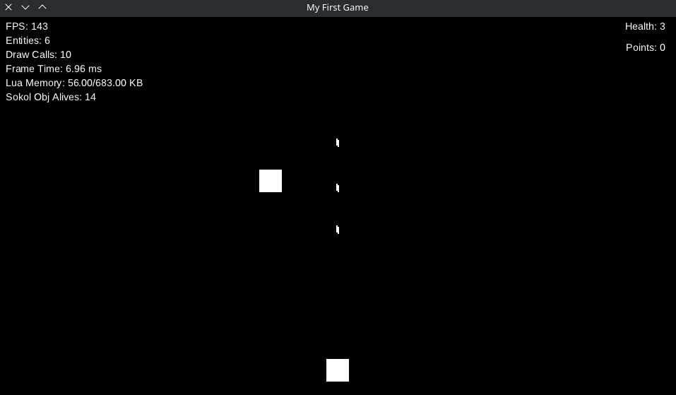
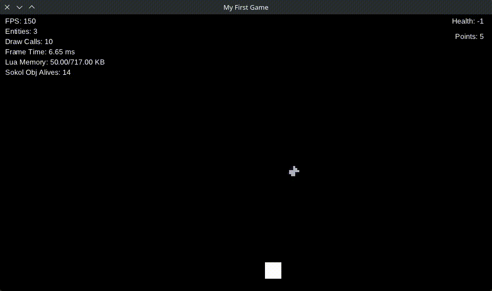
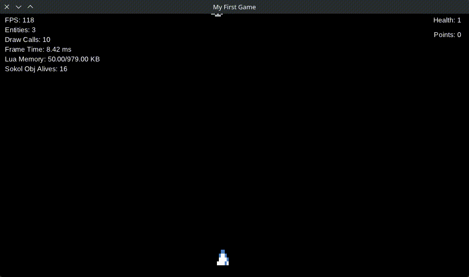

# Adding Textures

In this section we will add **textures** to our game.  
We will add textures for the **player**, **meteors**, and **bullets**.

You can download the assets used in this tutorial from  
[here](https://github.com/sucataengine/meteors-sucata/src/branch/main/sprites).

---

## Bullet Texture

Let's start with the simplest texture: the **bullet**.

Update the state in `entities/bullet.lua`:

```lua
local function bullet(x, y)
	return {
		state = {
			x = x,
			y = y,
			texture = "src://sprites/bullet.png", -- Texture path
			width = 16, -- Bullet width
			height = 16 -- Bullet height
		},
		behaviours = {
			Behaviours.Bullet,
			Behaviours.ApplyForces,
			Behaviours.DrawSprite,
		}
	}
end

return bullet
```

> **Note**
> `src://` represents the **root directory of the project**.
> Use this prefix whenever referencing files inside the project.

The `DrawSprite` behaviour automatically renders textures when the `texture`, `width`, and `height` fields are present in the entity state.

The result should look like this:



---

## Meteor Texture

The meteor texture uses a **texture atlas** so the meteor appearance changes based on its health.

First, define the texture in the meteor entity (`entities/meteor.lua`):

```lua
local function meteor()
	return {
		state = {
			y = -16,
			texture = "src://sprites/meteor.png", -- Meteor texture
			atlas_size = 8 -- Split the texture into 8 horizontal frames
		},
		behaviours = {
			Behaviours.RandomStartPosition,
			Behaviours.Meteor,
			Behaviours.ApplyForces,
			Behaviours.DrawSprite,
		}
	}
end

return meteor
```

Now update the meteor behaviour in `behaviours/meteor.lua`:

```lua
return {
	init = function(state)
		sucata.scene.add_tag(state, "meteor")

		state.speed = state.speed or math.random(100, 200)
		state.health = state.health or math.random(1, 5)
		state.force_y = state.speed
	end,

	tick = function(state)
		if state.y > 540 then
			sucata.events.emit("meteor_reached", state)
			sucata.scene.destroy(state)
		end

		-- Select the texture frame based on meteor health
		state.atlas_x = state.health - 1
	end
}
```

Now the meteor sprite will change depending on its health:



---

## Player Texture

For the player we will add a **texture atlas** that represents the ship inclination.

First create a new behaviour in `behaviours/inclination.lua`:

```lua
return {
	init = function(state)
		state.inclination = 2 -- Initial inclination frame
	end,

	tick = function(state)
		local dt = sucata.time.get_delta()

		if sucata.input.is_held("left", "a") then
			state.inclination = sucata.math.clamp(
				state.inclination - (15 * dt),
				0,
				4
			)

		elseif sucata.input.is_held("right", "d") then
			state.inclination = sucata.math.clamp(
				state.inclination + (15 * dt),
				0,
				4
			)

		else
			state.inclination = sucata.math.lerp(
				state.inclination,
				2,
				dt * 10
			)
		end

		state.atlas_x = math.floor(state.inclination)
	end
}
```

Register the behaviour in `behaviours/init.lua`:

```lua
return {
	...
	Inclination = require("behaviours.inclination"),
}
```

Now update the player entity in `entities/player.lua`:

```lua
local function player(x, y)
	return {
		state = {
			x = x,
			y = y,
			texture = "src://sprites/ship.png", -- Player texture
			atlas_size = 8 -- Split texture into 8 frames
		},
		behaviours = {
			Behaviours.Player,
			Behaviours.Inclination,
			Behaviours.Shooter,
			Behaviours.DrawSprite,
		}
	}
end

return player
```

Now the player ship will tilt depending on movement:


