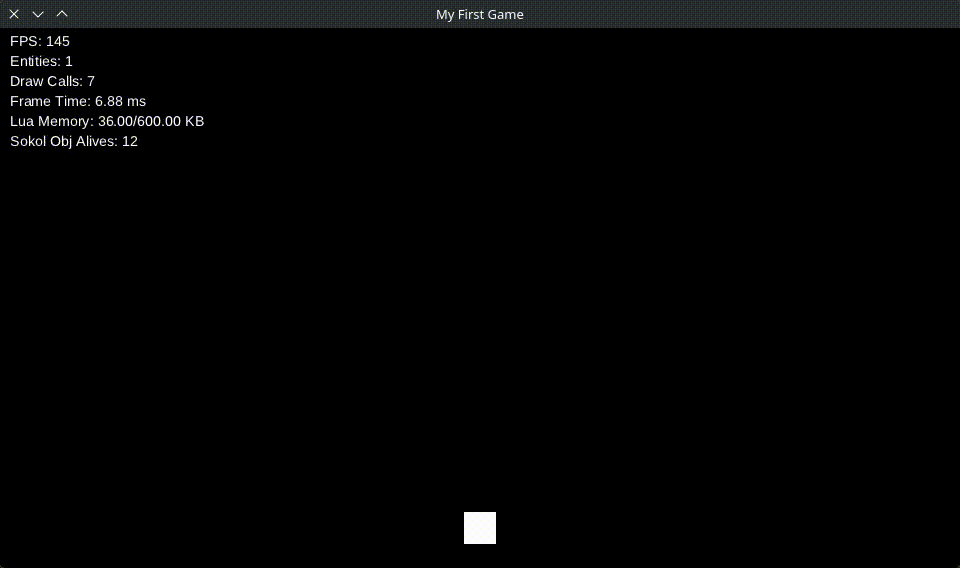

# Creating Meteors

Now we will create the enemies of the game: **meteors** that fall from the sky.

## Creating the Meteor Behaviour

First, we will create a behaviour responsible for making meteors fall.

Create the file `behaviours/apply_forces.lua`, that will make the meteor move:
```lua
return {
	init = function (state)
		state.x = state.x or 0
		state.y = state.y or 0
		state.force_x = state.force_x or 0
		state.force_y = state.force_y or 0
	end,
	tick = function (state) 
		local dt = sucata.time.get_delta()
		state.x = state.x + (state.force_x * dt) -- Move x by force_x in the state
 		state.y = state.y + (state.force_y * dt) -- Move y by force_y in the state
	end
}
```

Create the file `behaviours/meteor.lua`:

```lua
return {
	init = function(state)
		sucata.scene.add_tag(state, "meteor") -- Add the "meteor" tag to the entity
		state.speed = state.speed or math.random(100, 200) -- Random fall speed
		state.health = state.health or math.random(1, 5) -- Random meteor health
		state.force_y = state.speed -- define force to move
	end,

	tick = function(state)
		if state.y > 540 then -- When the meteor leaves the screen
			sucata.events.emit("meteor_reached", state) -- Emit an event
			sucata.scene.destroy(state) -- Destroy the meteor
		end
	end
}
```

Register the behaviour in `behaviours/init.lua`:

```lua
return {
	...
	ApplyForces = require("behaviours.apply_forces"),
	Meteor = require("behaviours.meteor"),
}
```

---

## Creating the Meteor Entity

Now we will create the meteor entity.

Create the file `entities/meteor.lua`:

```lua
local function meteor(x, y)
	return {
		state = {
			x = x, -- Meteor position
			y = y
		},

		behaviours = {
			Behaviours.Meteor, -- Meteor logic
			Behaviours.ApplyForces, -- Apply forces logic
			Behaviours.DrawSprite -- Render the meteor
		}
	}
end

return meteor
```

Spawn a meteor in `main.lua`:

```lua
local Meteor = require("entities.meteor")

sucata.scene.spawn(Meteor(300, 100))
```

The game should now look like this:



---

## Creating a Random Start Position Behaviour

Now we will create a behaviour that spawns entities at a **random position**.

Create the file `behaviours/random_start_position.lua`:

```lua
return {
	init = function(state)
		state.x = state.x or math.random(16, 960 - 16) -- Random X within screen bounds
		state.y = state.y or math.random(16, 540 - 16) -- Random Y within screen bounds
	end
}
```

Register the behaviour in `behaviours/init.lua`:

```lua
return {
	...
	RandomStartPosition = require("behaviours.random_start_position")
}
```

---

## Spawning Meteors at Random Positions

Now we will update the meteor entity so it spawns at a random X position.

Update `entities/meteor.lua`:

```lua
local function meteor()
	return {
		state = {
			y = -16 -- Start slightly above the screen
		},

		behaviours = {
			Behaviours.RandomStartPosition, -- Random spawn position
			Behaviours.Meteor, -- Meteor logic
			Behaviours.ApplyForces, -- Apply forces logic
			Behaviours.DrawSprite -- Render the meteor
		}
	}
end

return meteor
```

Now meteors will spawn with a **random X position** and fall from the top of the screen.
