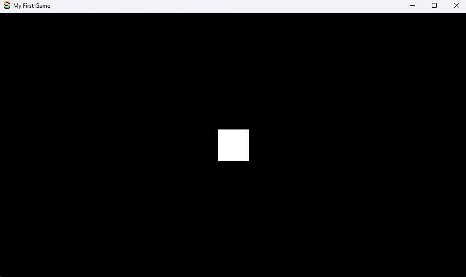
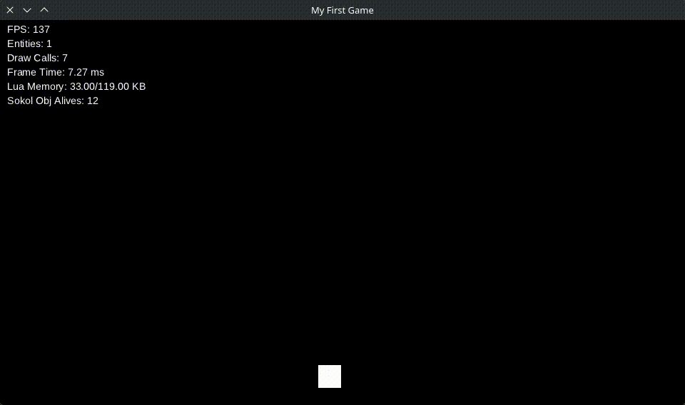

# Creating the Player

In this section, we will create the first entity of the game: the **player**.  
We will also add movement so the player can move around the screen.

## Creating the Draw Behaviour

First, we need a behaviour responsible for rendering a sprite.

Create the file `behaviours/draw_sprite.lua`:

```lua
return {
	init = function(state) -- Called once when the entity enters the scene
		-- Try to get values from the state, fallback to defaults if missing
		state.x = state.x or 0
		state.y = state.y or 0
		state.width = state.width or 32
		state.height = state.height or 32
		state.texture = state.texture or ""
		state.atlas_x = state.atlas_x or 0
	end,

	draw = function(state) -- Called every frame during rendering
		sucata.graphic.draw_rect({
			x = state.x,
			y = state.y,
			width = state.width,
			height = state.height,
			texture = state.texture,
			origin = 0.5,
			atlas_size = state.atlas_size,
			atlas_x = state.atlas_x
		})
	end
}
```

Now we need to register this behaviour.

Create the file `behaviours/init.lua`:

```lua
return {
	DrawSprite = require("behaviours.draw_sprite")
}
```

Then expose the behaviours globally in `main.lua`:

```lua
Behaviours = require("behaviours")
```

> **Tip**
> It is recommended to create a **single shared reference for behaviours** instead of requiring them locally.
> Sucata reuses behaviours that share the same pointer, which improves performance.

---

## Creating the Player Entity

Now we will create the player entity.

Create the file `entities/player.lua`:

```lua
local function player(x, y)
	return {
		state = {
			x = x, -- Player position
			y = y
		},

		behaviours = {
			Behaviours.DrawSprite -- Render the player
		}
	}
end

return player
```

Now spawn the player in `main.lua`:

```lua
local Player = require("entities.player")

sucata.scene.spawn(Player(480, 500)) -- Spawn player near the center of the screen
```

The game should now look like this:



---

## Creating the Player Behaviour

Next, we will add player movement using the keyboard.

Create the file `behaviours/player.lua`:

```lua
return {
	init = function(state)
		state.speed = state.speed or 200 -- Default movement speed
	end,

	tick = function(state)
		local dt = sucata.time.get_delta() -- Time between frames

		if sucata.input.is_held("left", "a") then
			state.x = state.x - state.speed * dt
		elseif sucata.input.is_held("right", "d") then
			state.x = state.x + state.speed * dt
		end
	end
}
```

Player input is handled through the `sucata.input` module.

Now register the behaviour in `behaviours/init.lua`:

```lua
return {
	DrawSprite = require("behaviours.draw_sprite"),
	Player = require("behaviours.player")
}
```

Then add the player behaviour to the entity in `entities/player.lua`:

```lua
local function player(x, y)
	return {
		state = {
			x = x,
			y = y
		},

		behaviours = {
			Behaviours.Player,     -- Handle player logic
			Behaviours.DrawSprite  -- Render player
		}
	}
end

return player
```

> **Note**
> Behaviours are executed **in order**, so the player logic runs before rendering.

Now the player can move:



---

## Adding Screen Boundaries

To finish the initial player implementation, we will prevent the player from leaving the screen.

Update `behaviours/player.lua`:

```lua
return {
	init = function(state)
		state.speed = state.speed or 200
	end,

	tick = function(state)
		local dt = sucata.time.get_delta()

		-- Add horizontal boundaries
		if sucata.input.is_held("left", "a") and state.x > 20 then
			state.x = state.x - state.speed * dt
		elseif sucata.input.is_held("right", "d") and state.x < 492 then
			state.x = state.x + state.speed * dt
		end
	end
}
```

Now we have the **first working version of the player**!