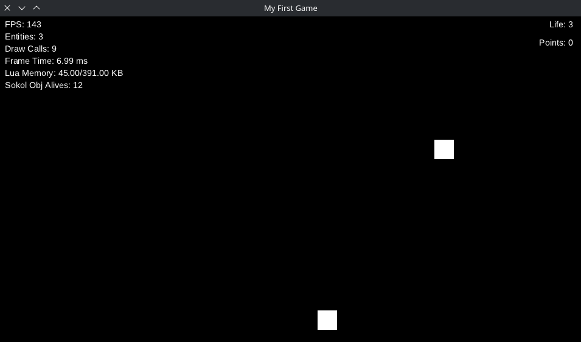

# Game Manager

Now we will create a **Game Manager**, responsible for managing core game systems such as:

- Meteor spawning
- Player health
- Player points

---

## Meteor Spawner

First, we will create a system that spawns a new meteor every **5 seconds**.

Create the file `behaviours/meteor_spawner.lua`:

```lua
local meteor = require("entities.meteor")

return {
	init = function(state)
		state.spawner_time = state.spawner_time or 5 -- Time between meteor spawns

		-- Create a timer that spawns meteors
		sucata.time.create_timer(function ()
			sucata.scene.spawn(meteor())
		end, {
			time = state.spawner_time,
			loop = true,
			auto_start = true
		})
	end
}
```

Register the behaviour in `behaviours/init.lua`:

```lua
return {
	...
	MeteorSpawner = require("behaviours.meteor_spawner")
}
```

---

## Game Manager Entity

Now we will create the **Game Manager entity**.

Create the file `entities/game_manager.lua`:

```lua
return {
	state = {},
	behaviours = {
		Behaviours.MeteorSpawner
	}
}
```

Spawn the Game Manager in `main.lua`:

```lua
local game_manager = require("entities.game_manager")

sucata.scene.spawn(game_manager)
```

---

## Player health

Now we will implement the player's health system.

First, create a state module in `states/player_health.lua`:

```lua
local function remove(state)
	if not state.health then -- Safe state modification
		return
	end

	state.health = state.health - 1
end

return {
	remove = remove
}
```

> **Note**
> *States* are modules that contain logic for modifying entity state.
> They can be called from any behaviour.

Now create the behaviour `behaviours/player_health.lua`:

```lua
local health = require("states.health")

return {
	init = function(state)
		state.health = state.health or 3 -- Default player health

		sucata.events.on(state, "meteor_reached", function(_)
			health.remove(state)

			if state.health <= 0 then
				-- Game over logic (to be implemented)
			end
		end)
	end
}
```

Register the behaviour in `behaviours/init.lua`:

```lua
return {
	...
	PlayerHealth = require("behaviours.player_health")
}
```

Add it to the Game Manager in `entities/game_manager.lua`:

```lua
return {
	state = {},
	behaviours = {
		Behaviours.PlayerHealth,
		Behaviours.MeteorSpawner
	}
}
```

---

## Player Points

Next, we will implement the player scoring system.

Create the state module `states/player_points.lua`:

```lua
local function add_points(state, points)
	if not state.points then -- Safe state modification
		return
	end

	state.points = state.points + points
end

return {
	add_points = add_points
}
```

Now create the behaviour `behaviours/player_points.lua`:

```lua
local player_points = require("states.player_points")

return {
	init = function(state)
		state.points = 0 -- Initial score

		sucata.events.on(state, "meteor_destroyed", function(_)
			player_points.add_points(state, 5)
		end)
	end
}
```

Register the behaviour in `behaviours/init.lua`:

```lua
return {
	...
	PlayerPoints = require("behaviours.player_points")
}
```

Update the Game Manager in `entities/game_manager.lua`:

```lua
return {
	state = {},
	behaviours = {
		Behaviours.PlayerHealth,
		Behaviours.PlayerPoints,
		Behaviours.MeteorSpawner
	}
}
```

---

## Drawing the UI

Finally, we will draw the player UI on the screen.

Create the behaviour `behaviours/draw_player_ui.lua`:

```lua
return {
	draw = function(state)
		sucata.graphic.draw_text({
			text = "Health: " .. state.health,
			x = 960 - 16,
			y = 10,
			font_size = 16,
			align = "right"
		})

		sucata.graphic.draw_text({
			text = "Points: " .. state.points,
			x = 960 - 16,
			y = 40,
			font_size = 16,
			align = "right"
		})
	end
}
```

Register the behaviour in `behaviours/init.lua`:

```lua
return {
	...
	DrawPlayerUi = require("behaviours.draw_player_ui")
}
```

Add the UI behaviour to the Game Manager:

```lua
return {
	state = {},
	behaviours = {
		Behaviours.PlayerHealth,
		Behaviours.PlayerPoints,
		Behaviours.MeteorSpawner,
		Behaviours.DrawPlayerUi -- Rendering should happen last
	}
}
```

The UI should now appear like this:


