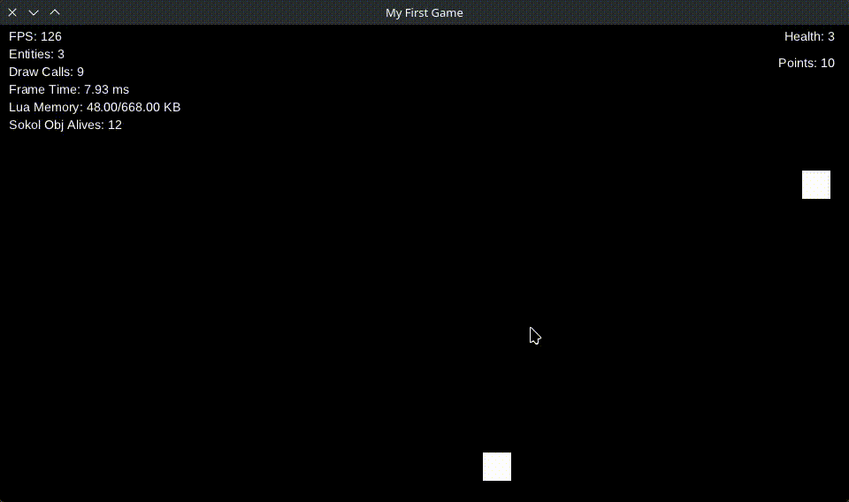

# Shooting Meteors

Now it's time to **shoot some meteors**.  
In this section we will create bullets and implement the logic required to destroy meteors and earn points.

---

## Creating the Bullet Behaviour

First, create the bullet behaviour in `behaviours/bullet.lua`:

```lua
local health = require("states.health")

return {
	init = function(state)
		state.speed = state.speed or 400 -- Bullet speed (default: 400)
		state.force_y = -state.speed -- Apply upward force
	end,

	tick = function(state)
		-- Destroy bullet when it leaves the screen
		if state.y < -16 then
			sucata.scene.destroy(state)
		end

		-- Get all meteors in the scene
		local meteors = sucata.scene.get_entities_by_tag("meteor")

		for _, id in ipairs(meteors) do
			local meteor = sucata.scene.find_by_id(id)

			if meteor and sucata.math.overlapping({
				x = state.x - 8,
				y = state.y - 8,
				width = 16,
				height = 16
			}, {
				x = meteor.x - 16,
				y = meteor.y - 16,
				width = 32,
				height = 32
			}) then
				-- Damage the meteor
				health.remove(meteor)

				if meteor.health <= 0 then
					sucata.events.emit("meteor_destroyed", meteor)
					sucata.scene.destroy(meteor)
				end

				-- Destroy the bullet
				sucata.scene.destroy(state)
				break
			end
		end
	end
}
```

Register the behaviour in `behaviours/init.lua`:

```lua
return {
	...
	Bullet = require("behaviours.bullet"),
}
```

---

## Creating the Bullet Entity

Now create the bullet entity in `entities/bullet.lua`:

```lua
local function bullet(x, y)
	return {
		state = {
			x = x,
			y = y
		},

		behaviours = {
			Behaviours.Bullet,      -- Bullet logic
			Behaviours.ApplyForces, -- Apply movement forces
			Behaviours.DrawSprite   -- Render the bullet
		}
	}
end

return bullet
```

---

## Creating the Shooter Behaviour

Now we will allow the player to shoot bullets.

Create the file `behaviours/shooter.lua`:

```lua
local bullet = require("entities.bullet")

return {
	tick = function(state)
		if sucata.input.is_pressed("space", "enter") then
			sucata.scene.spawn(bullet(state.x, state.y - 16))
		end
	end
}
```

Register the behaviour in `behaviours/init.lua`:

```lua
return {
	...
	Shooter = require("behaviours.shooter"),
}
```

---

## Adding the Shooter to the Player

Now add the shooter behaviour to the player entity in `entities/player.lua`:

```lua
local function player(x, y)
	return {
		state = {
			x = x,
			y = y
		},

		behaviours = {
			Behaviours.Player,   -- Player movement
			Behaviours.Shooter,  -- Shooting logic
			Behaviours.DrawSprite -- Render player
		}
	}
end

return player
```

> **Note**
> Behaviours are executed in order.
> The player logic runs first, followed by shooting logic, and finally rendering.

---

Now when you run the game, it should look like this:


